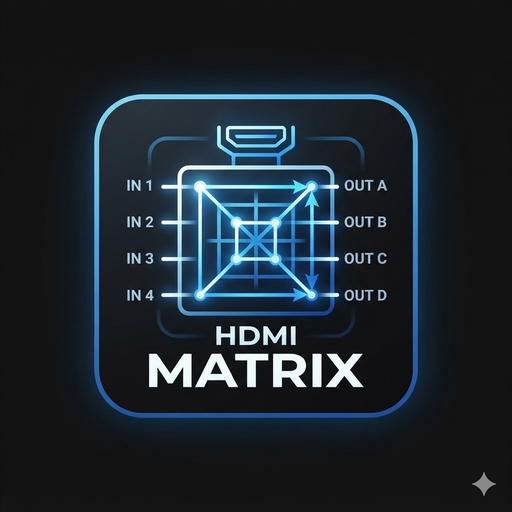

<p align="center">
  
</p>

# 🔌 Orei BK808 HDMI Matrix Controller for Home Assistant

[](https://github.com/hacs/integration)
[](LICENSE)

A fully-featured Home Assistant integration for the Orei BK808 8x8 HDMI Matrix Switch, with complete CEC control, routing, presets, and a guided GUI setup — no YAML or manual file edits required.

## ✨ Features

- 🚀 **GUI setup wizard** with automatic connection testing (no login needed)
- 📺 **Native HA media players** — one per port, works with standard media-player cards (play/pause/volume/power, and per-output *input source* = routing). Each player reports the port's real power state (`on`/`off`) from the matrix's own status, so history and automations see when a device actually switches on/off
- 🎮 **Full CEC control** for all inputs and outputs (device-mapped command indices)
- 🔄 **8×8 routing matrix** — route any input to any output
- ⚡ **Preset save/recall/rename** for instant scene switching
- 🏷️ **Custom input/output names** (auto-detected from the device, editable in options)
- 🧪 **Automated test suite** with CI

## 🎯 Supported Devices

- ✅ Orei BK808 8K 8x8 HDMI Matrix Switch (tested)
- 🔶 Orei BK404 4x4 (partial, untested)

## 📋 Prerequisites

- Home Assistant 2024.1 or later
- HACS installed (recommended)
- Your Orei BK808 connected to your network via Ethernet

## 💡 What media-player means for a matrix

A matrix switch doesn't "play" media — it routes signals and issues CEC frames. So this integration models each port as a media player for UI convenience, where:

- **State** (`on`/`off`) = the matrix's own live power / connection status for that port (`inactive[]` for sources, `allconnect[]` for sinks). Polled every 5s.
- **Media controls** (play/pause/volume/mute/power) = CEC commands forwarded to that port's device.
- **Input source** (on the output players) = routing the chosen input to that output.

That's what you'd expect from "play a PS5 through the Living Room AVR" — but the matrix itself doesn't track what's playing.

## 🚀 Installation

### Step 1: Install via HACS

1. Open **HACS** in Home Assistant
2. Go to **⋮ (three-dot menu)** → **Custom repositories**
3. Add this repository with category **Integration**
4. Search for **"Orei BK808"** → click **Download**
5. **Restart Home Assistant**

### Step 2: Connect Your Matrix (GUI Only)

1. Go to **Settings → Devices & Services → + Add Integration**
2. Search for **"Orei BK808"**
3. The setup wizard will walk you through:

| Step | What You Do |
|------|-------------|
| 1. Connection | Enter your matrix's IP address or hostname (no login needed) |
| 2. Verify | The integration tests the connection automatically and reads the device's port names |
| 3. Naming | Port names are pre-filled from the device. Keep them as-is, or rename any input/output to friendly names (e.g. "PS5", "Living Room AVR") |
| 4. Done | Entities appear automatically with your chosen names — start using! |

**That's it.** No credentials, no YAML, no edits. If the connection test fails, you'll get a clear error and can retry. You can rename inputs/outputs later (or switch back to device-reported names) under the integration's **Options**.

## 🎨 Dashboard

After setup, add entities to any dashboard via the UI editor:
**Edit Dashboard → + Add Card → Entities / Button / Tile**

Pick from routing selectors, CEC buttons, power switches, and status sensors — all available through the standard entity picker. A ready-made example dashboard YAML is included in this repo (`lovelace_dashboard.yaml`) for those who want a head start, but it's entirely optional.

## 🎮 CEC Commands Available

Per input device (source): power on/off, transport (play/pause/stop/next/previous/fast-forward/rewind), loop, navigation (up/down/left/right), enter, menu, mute, and volume up/down.

Per output/display (sink): power on/off, enter, play, next/previous, loop, navigation (left/right/down), menu, mute, and volume up/down.

Command indices are the device-specific values extracted from the BK808's own web UI, so each button sends exactly the CEC frame the manufacturer's UI sends.

## 📦 Entities

| Entity | What It Does |
|--------|--------------|
| `media_player.output_<N>` | A **sink** (display/AVR) on output N. **Input source** = route that input to this output. Plus CEC play / next / previous / volume / mute / power. State reflects the sink's live connection status (`on`/`off`). |
| `media_player.input_<N>` | The **source device** on input N. Transport (play / pause / stop / next / prev), volume up/down/mute, and power on/off — all CEC. State reflects the source's live power status (`on` when powered, `off` when not). |
| `switch.matrix_power` | Whole-matrix power (standby). |
| `switch.output_<N>_mute` | HDMI audio mute per output. |
| `select.output_<N>_route` | Pure routing dropdown (input → output). |
| `select.input_<N>_remote` / `select.output_<N>_remote` | All-in-one quick-action dropdowns (routing + mute + every CEC command on that port). |
| `button.input_<N>_<cmd>` / `button.output_<N>_<cmd>` | One button per CEC command, for fine-grained dashboards. |
| `sensor.output_<N>_routed_input` | Which input is currently routed to output N. |
| `sensor.power` / `sensor.firmware` | Matrix power state / firmware version. |

> **Tip:** For the cleanest UI, just add the 16 `media_player.*` entities — HA's native **media-control** card already gives you play/pause/volume/power, and the output players include the routing "Input source" picker. Hide the `button.*` / `select.*` entities if you don't need the granular view.

## 🔧 Services

| Service | Description |
|---------|-------------|
| `orei_bk808.route` | Route an input (1-8) to an output (1-8) |
| `orei_bk808.save_preset` | Save current routing to a slot (1-8) |
| `orei_bk808.recall_preset` | Recall a saved preset |
| `orei_bk808.clear_preset` | Clear a preset slot |
| `orei_bk808.set_preset_name` | Rename a preset slot |
| `orei_bk808.cec_command` | Send a CEC command to an input or output port |
| `orei_bk808.set_power` | Matrix power on/off |
| `orei_bk808.set_mute` | Mute/unmute an output's audio |
| `orei_bk808.refresh` | Force a status refresh |

All services are callable from the UI (Developer Tools → Actions) as well as automations and scripts.

## 🔐 Security

- The matrix's open JSON API needs no login by default; only the host is stored in Home Assistant's config entry
- The device uses a self-signed TLS certificate, so HA connects with verification disabled (typical for local AV gear)
- We recommend placing AV equipment on an isolated VLAN, and enabling the web login / changing the default password on the matrix if you expose it beyond your LAN

## 🐛 Troubleshooting

### Connection failed during setup?

Verify the matrix is reachable by opening its web UI in a browser (e.g. `https://my-matrix.local`). Common causes:

- Wrong IP address or hostname
- Firewall blocking HTTPS (port 443)
- Matrix powered off

### CEC commands not working?

- Enable CEC on your devices (Samsung: Anynet+, LG: SimpLink, Sony: BRAVIA Sync)
- Use certified HDMI cables — cheap cables often fail CEC
- Some devices ignore certain CEC commands

## 🧪 Development

```bash
git clone <your-repo-url>
cd orei_bk808
pip install pytest pytest-asyncio pytest-homeassistant-custom-component
pytest tests/ -v 
```
